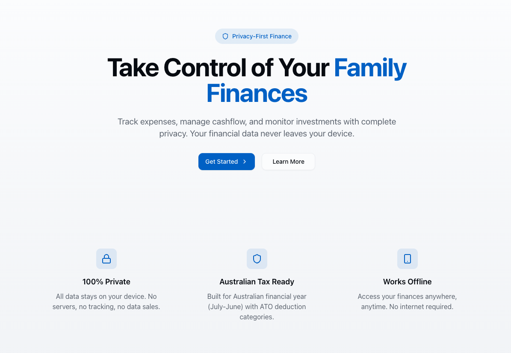

<div align="center">

# SafeFlow

### Your Financial Data. Your Device. Your Control.

[](https://github.com/dipjyotimetia/SafeFlow/actions/workflows/nextjs.yml)
[](https://opensource.org/licenses/MIT)
[](https://nodejs.org/)
[](https://nextjs.org/)
[](https://www.typescriptlang.org/)
[](CONTRIBUTING.md)

**Privacy-first personal finance management built for Australians**

[**Live Demo**](https://dipjyotimetia.github.io/SafeFlow) · [**Get Started**](#-quick-start) · [**User Guide**](docs/USER_GUIDE.md) · [**Contributing**](CONTRIBUTING.md)

<br />



</div>

<br />

## Why SafeFlow?

> Most finance apps store your data on their servers. SafeFlow doesn't.

| Traditional Apps | SafeFlow |
|-----------------|----------|
| Data stored on company servers | Data stays on YOUR device |
| Requires account creation | Works offline, no login needed |
| Sells/uses your financial data | Zero telemetry, zero tracking |
| Subscription fees | Free and open source |
| Generic categories | Built for Australian tax system |

<br />

## Highlights

<table>
<tr>
<td width="50%">

### Offline-First Architecture
All data stored locally in IndexedDB. No internet? No problem. Your finance app works anywhere.

</td>
<td width="50%">

### End-to-End Encryption
Optional cloud backup with AES-GCM encryption. Your password never leaves your device.

</td>
</tr>
<tr>
<td width="50%">

### Australian Tax Ready
Built-in ATO tax brackets, Medicare levy, CGT calculations, franking credits, and FY handling.

</td>
<td width="50%">

### Smart PDF Parsing
Drop your bank statement, we extract the transactions. Supports ANZ, CBA, NAB, Westpac, and more.

</td>
</tr>
</table>

<br />

## Features

<details open>
<summary><strong>Core Finance Management</strong></summary>

- **Multi-account tracking** — Bank accounts, credit cards, investments, crypto, and assets
- **Transaction management** — Import, categorize, and analyze your spending
- **Budget tracking** — Set and monitor budgets by category with alerts
- **Family finances** — Multi-member household financial tracking

</details>

<details>
<summary><strong>Investment Portfolio</strong></summary>

- **Holdings tracker** — Stocks, ETFs, crypto, and managed funds
- **Portfolio analytics** — Performance charts, allocation breakdown, and dividend tracking
- **CGT calculations** — Capital gains tax with FIFO/LIFO/Specific ID cost basis methods
- **Franking credits** — Australian dividend imputation credit tracking

</details>

<details>
<summary><strong>Australian Tax</strong></summary>

- **Tax brackets** — Current ATO tax rates and Medicare levy
- **Financial year** — Proper July-June FY handling (e.g., "2024-25")
- **ATO categories** — Pre-configured deduction categories aligned with ATO requirements
- **Tax estimation** — Real-time tax liability calculations

</details>

<details>
<summary><strong>Property Investment</strong></summary>

- **Property portfolio** — Track multiple investment properties
- **Loan management** — Multiple loans, offset accounts, and interest tracking
- **Rental income** — Lease tracking and rental yield calculations
- **Depreciation** — Div 40 and Div 43 depreciation schedules
- **Property modeling** — Cash flow projections and scenario analysis
- **Affordability calculator** — Purchase capacity analysis

</details>

<details>
<summary><strong>Superannuation</strong></summary>

- **Super tracking** — Monitor multiple super accounts
- **Contribution tracking** — Concessional and non-concessional contributions
- **Performance history** — Track super growth over time

</details>

<details>
<summary><strong>Import & Sync</strong></summary>

- **PDF statement parsing** — Automatic extraction from bank statements
- **Supported banks** — ANZ, CBA, NAB, Westpac, ING, Bendigo, Macquarie, Up, and more
- **Crypto imports** — CoinSpot, Swyftx, Raiz
- **Encrypted cloud sync** — Optional Google Drive backup with AES-GCM encryption

</details>

<details>
<summary><strong>AI Features (Experimental)</strong></summary>

- **Smart categorization** — Learn from your categorization patterns
- **AI assistant** — Query your finances using local Ollama LLM

</details>

<br />

## Quick Start

```bash
# Clone and install
git clone https://github.com/dipjyotimetia/SafeFlow.git
cd SafeFlow && npm install

# Start the app
npm run dev
```

Open [localhost:3000](http://localhost:3000) and you're ready to go.

## Documentation

- [User Guide](docs/USER_GUIDE.md) - Full walkthrough of daily workflows
- [Backup and Sync Guide](docs/BACKUP_AND_SYNC.md) - Data safety and restore process
- [Troubleshooting](docs/TROUBLESHOOTING.md) - Common issues and fixes

<details>
<summary><strong>Environment Variables (Optional)</strong></summary>

Copy `.env.example` to `.env.local`:

```bash
# Google Drive Sync
NEXT_PUBLIC_GOOGLE_CLIENT_ID=your-client-id

# Ollama LLM (defaults to localhost:11434)
NEXT_PUBLIC_OLLAMA_URL=http://localhost:11434
```

</details>

<br />

## Tech Stack

<table>
<tr>
<td align="center" width="96">
<a href="https://nextjs.org">

</a>
<br>Next.js 16
</td>
<td align="center" width="96">
<a href="https://react.dev">

</a>
<br>React 19
</td>
<td align="center" width="96">
<a href="https://www.typescriptlang.org">

</a>
<br>TypeScript
</td>
<td align="center" width="96">
<a href="https://tailwindcss.com">

</a>
<br>Tailwind 4
</td>
<td align="center" width="96">
<a href="https://vitest.dev">

</a>
<br>Vitest
</td>
</tr>
</table>

**Also using:** [Dexie](https://dexie.org) (IndexedDB) · [Zustand](https://zustand-demo.pmnd.rs) (State) · [Radix UI](https://www.radix-ui.com) · [Recharts](https://recharts.org) · [PDF.js](https://mozilla.github.io/pdf.js)

<br />

## Architecture

```
src/
├── app/                    # Next.js App Router
│   ├── (dashboard)/        # Main application routes
│   └── api/                # API routes (Ollama proxy)
├── components/             # React components
│   ├── ui/                 # shadcn/ui base components
│   └── [feature]/          # Feature-specific components
├── domain/                 # Business logic (DDD)
│   ├── services/           # Tax, investment, account services
│   └── value-objects/      # Money, FinancialYear
├── hooks/                  # React hooks (data fetching)
├── lib/                    # Infrastructure
│   ├── db/                 # Dexie schema & repositories
│   ├── parsers/            # PDF statement parsers
│   └── sync/               # Google Drive sync
├── stores/                 # Zustand state stores
└── workers/                # Web workers (PDF processing)
```

<details>
<summary><strong>Design Principles</strong></summary>

| Principle | Implementation |
|-----------|---------------|
| **Offline-first** | All data in IndexedDB. Works without internet. |
| **Privacy by default** | Zero telemetry. Zero analytics. Zero tracking. |
| **Cents not dollars** | Monetary values as integers to avoid floating-point errors. |
| **Incremental sync** | Only changed records sync, with version tracking. |
| **Australian focus** | FY, tax brackets, ATO categories built-in. |

</details>

<br />

## Commands

| Command | Description |
|---------|-------------|
| `npm run dev` | Start development server |
| `npm run build` | Production build (static export) |
| `npm run lint` | Run ESLint |
| `npm run test` | Run tests in watch mode |
| `npm run test:run` | Run tests once |
| `npm run test:coverage` | Run tests with coverage |

<br />

## Deployment

SafeFlow exports as static files and deploys to GitHub Pages on every push to `main`.

**Self-hosting:**

```bash
npm run build
# Serve the 'out' directory with any static file server
```

<br />

## Roadmap

- [ ] Additional bank statement parsers
- [ ] CSV import for generic transactions
- [ ] Recurring transaction detection
- [ ] Budget forecasting
- [ ] Self-hosted sync backend
- [ ] Mobile-responsive improvements
- [ ] Multi-format export (CSV, JSON, Excel)
- [ ] Multi-currency support

See [open issues](https://github.com/dipjyotimetia/SafeFlow/issues) for the full list.

<br />

## Contributing

We welcome contributions! See [CONTRIBUTING.md](CONTRIBUTING.md) for guidelines.

```bash
# Quick start
git checkout -b feature/amazing-feature
# Make changes, then:
npm run test:run && npm run lint
git commit -m "Add amazing feature"
git push origin feature/amazing-feature
# Open a Pull Request
```

<br />

## Community

- [Report a Bug](https://github.com/dipjyotimetia/SafeFlow/issues/new?template=bug_report.md)
- [Request a Feature](https://github.com/dipjyotimetia/SafeFlow/issues/new?template=feature_request.md)
- [Join Discussions](https://github.com/dipjyotimetia/SafeFlow/discussions)
- [Security Policy](SECURITY.md)
- [Code of Conduct](CODE_OF_CONDUCT.md)

<br />

## Acknowledgments

Built with [shadcn/ui](https://ui.shadcn.com), [Dexie.js](https://dexie.org), [PDF.js](https://mozilla.github.io/pdf.js), and the support of all [contributors](https://github.com/dipjyotimetia/SafeFlow/graphs/contributors).

<br />

---

<div align="center">

**[Live Demo](https://dipjyotimetia.github.io/SafeFlow)** · **[Get Started](#-quick-start)** · **[Star on GitHub](https://github.com/dipjyotimetia/SafeFlow)**

<sub>SafeFlow is not financial advice software. Tax calculations are estimates — verify with the ATO or a registered tax agent.</sub>

</div>
